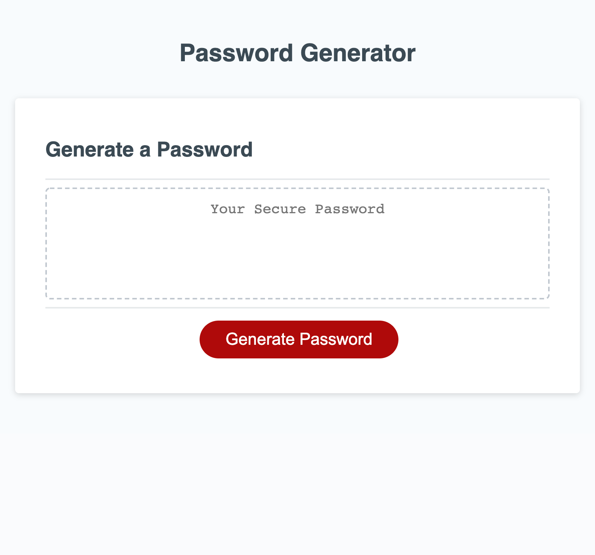

# Password-Generator

## What is the project?

This project is a simple password generator. The user has an option of selections between lowercase letters, uppercase letters, numbers, and/or special characters.

## What were the challenges?

One challenge I faced were how to add the different options which were selected to one string which would be randomized later. Another one was if the user's input for password lengh was outside of the scope two times in a row and then the cancel button was pressed, the remaining criteria selections would pop up. This was solved by including those prompts under the if else statatements regarding the length and validity of input.

## What was updated?

The project's button was inoperable at the beginning. Functionality to the button was added which would trigger a series of prompts and alers. These would eventually result in a password meeting the user's criteria.

## Why did I decide to do this project?

This project was really interesting to develop. I really wanted to explore the different math functions, how if/else statements, and for loops can be used in a very practical way.

## What I learned in the process?

I learned a lot more about computer logic and flow of code. It was really beneficial seeing how if/else statements work.

## What makes this project stand out?

This project is a great example of simple yet very effective password generator.

## Project Screenshot  

 
## Link to Deployed Project  

https://stevenstefanov.github.io/Password-Generator/

## Instalation

No instalation required on this project. Simply run as a normal website.

## Usage

This is a single page website. Upon start, user is presented with a blank box and a button that will begin the password generating process. Once pressed, the user is prompted to type in a number between 8 and 128. If the customer presses cancel, blank box is returned. If a number outside of that scope or another type of character is typed, an alert comes up that expresses that and the function starts over. If a qualifying entre is made, customer is prompted with four consecutive questions - does the user want the password to contain lowercase letters, uppercase letters, numbers, and special characters. If cancel is pressed on any one of those, function is terminated and black box is returned. If all selections are rejected, alert explaining that pops up and function begins again. If a numerical value within the range is input and at least one criteria is selected, the web browser will display the randomly generated password.

## Credits

Thank you to Columbia's Full-Stack Web Developer bootcamp for all the assistance and for teaching me all that I have learned. Credit also goes to Google for helping me find any needed resource.

## Licence

Copyright (c) 2021 Steven Stefanov

Permission is hereby granted, free of charge, to any person obtaining a copy
of this software and associated documentation files (the "Software"), to deal
in the Software without restriction, including without limitation the rights
to use, copy, modify, merge, publish, distribute, sublicense, and/or sell
copies of the Software, and to permit persons to whom the Software is
furnished to do so, subject to the following conditions:

The above copyright notice and this permission notice shall be included in all
copies or substantial portions of the Software.

THE SOFTWARE IS PROVIDED "AS IS", WITHOUT WARRANTY OF ANY KIND, EXPRESS OR
IMPLIED, INCLUDING BUT NOT LIMITED TO THE WARRANTIES OF MERCHANTABILITY,
FITNESS FOR A PARTICULAR PURPOSE AND NONINFRINGEMENT. IN NO EVENT SHALL THE
AUTHORS OR COPYRIGHT HOLDERS BE LIABLE FOR ANY CLAIM, DAMAGES OR OTHER
LIABILITY, WHETHER IN AN ACTION OF CONTRACT, TORT OR OTHERWISE, ARISING FROM,
OUT OF OR IN CONNECTION WITH THE SOFTWARE OR THE USE OR OTHER DEALINGS IN THE
SOFTWARE.